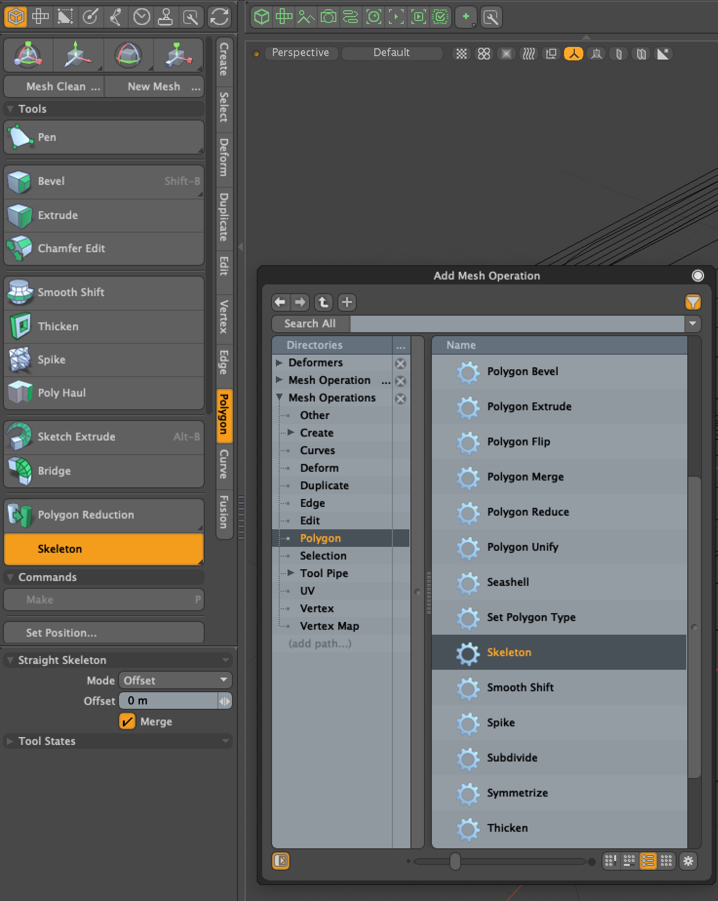
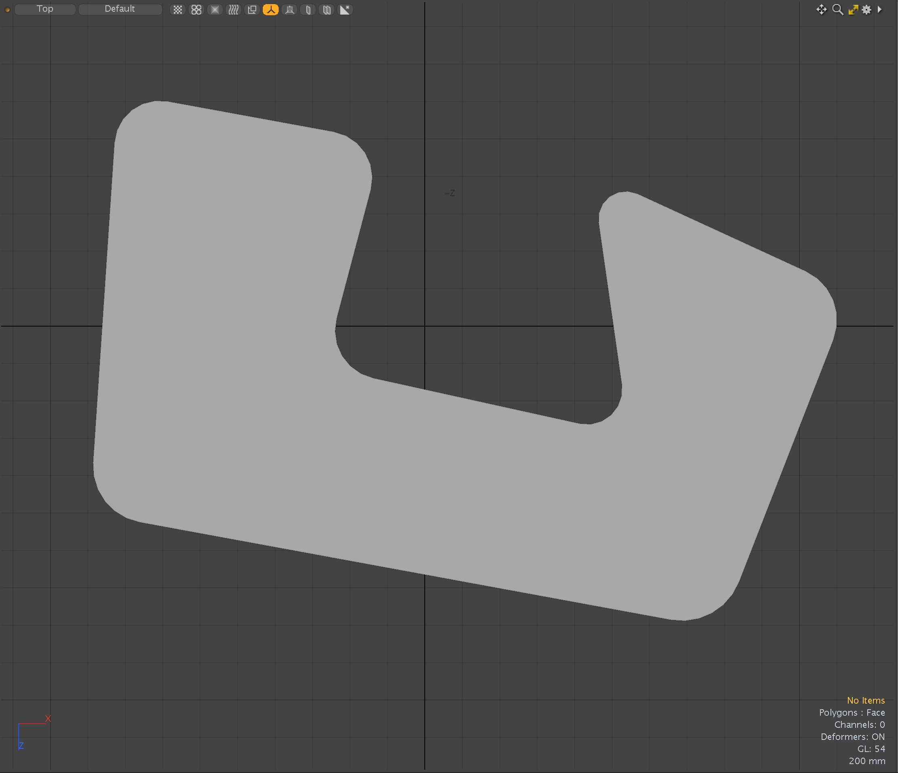
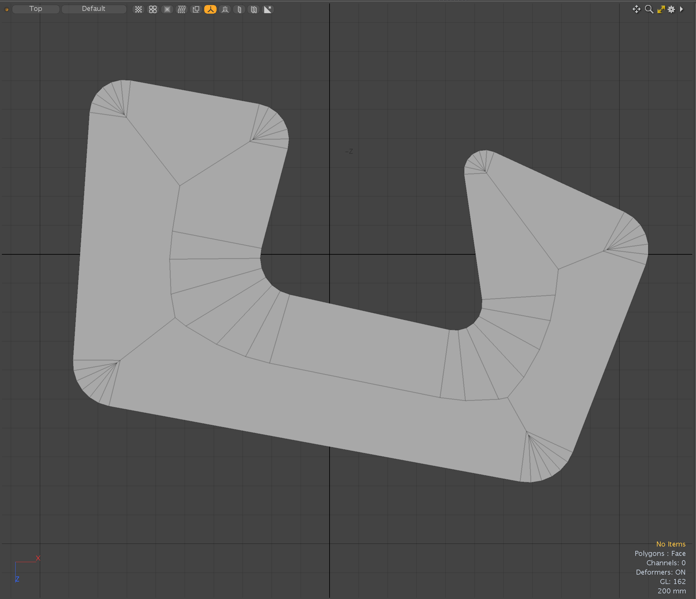
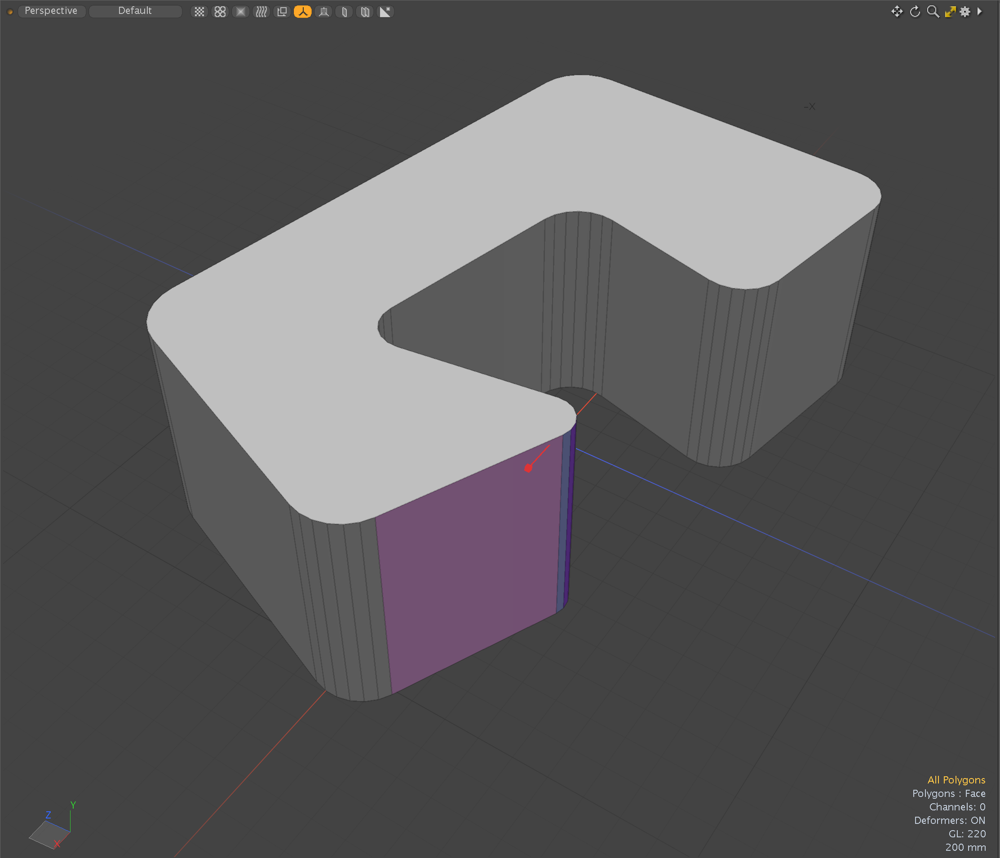
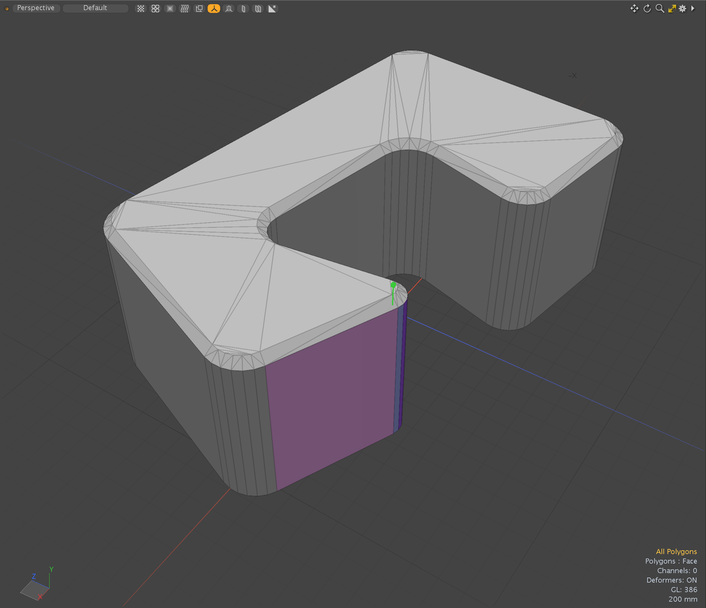
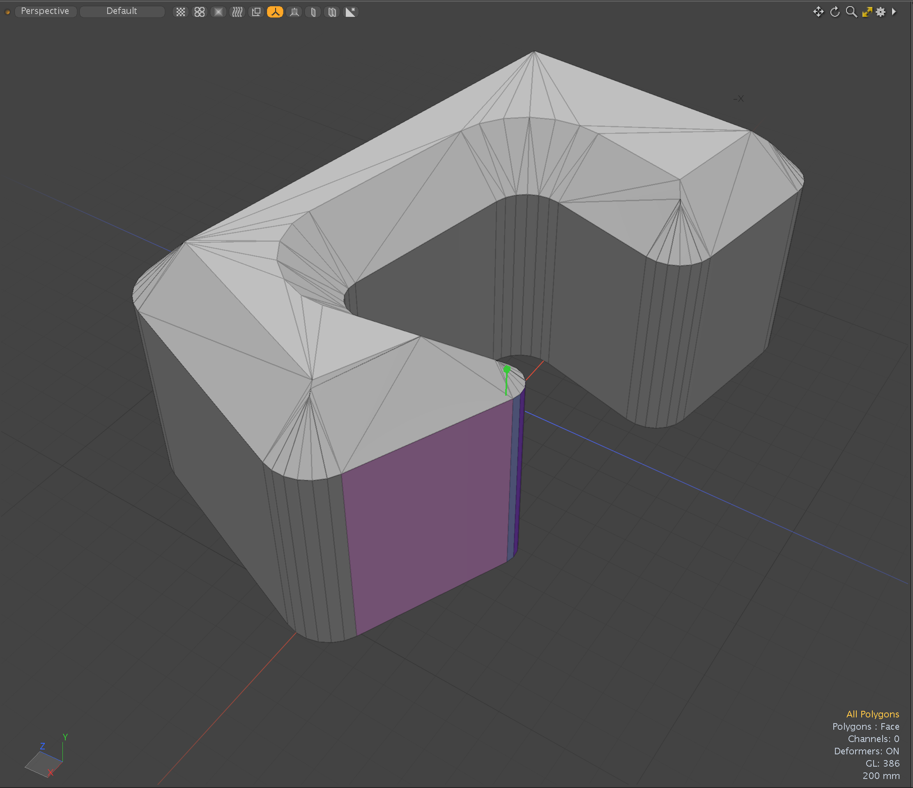
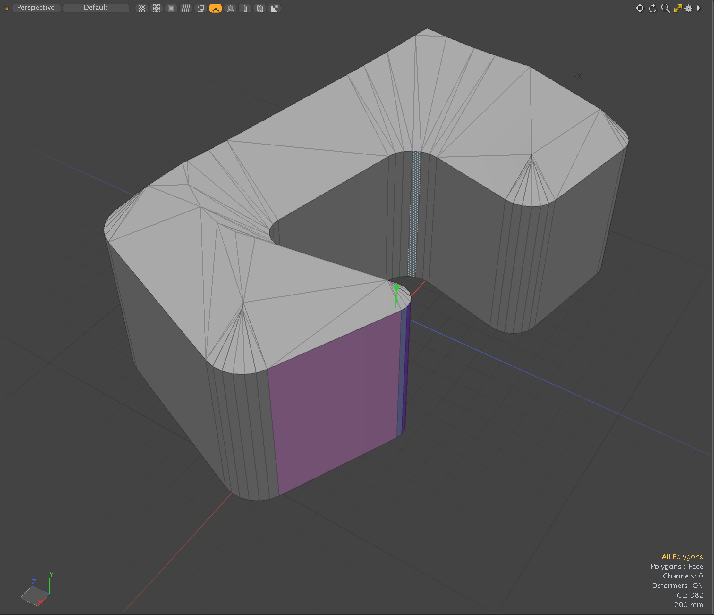
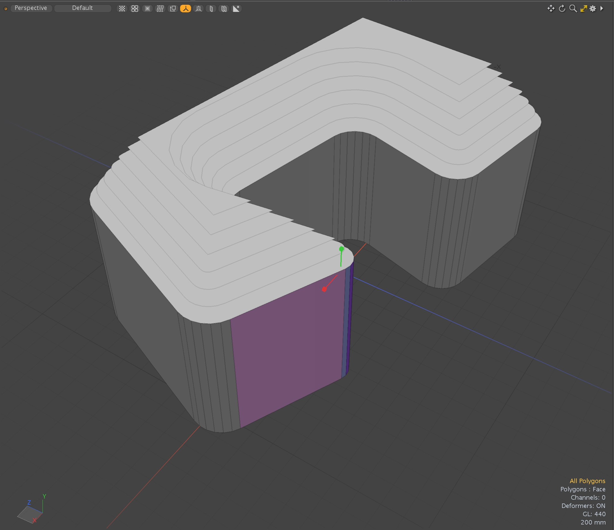
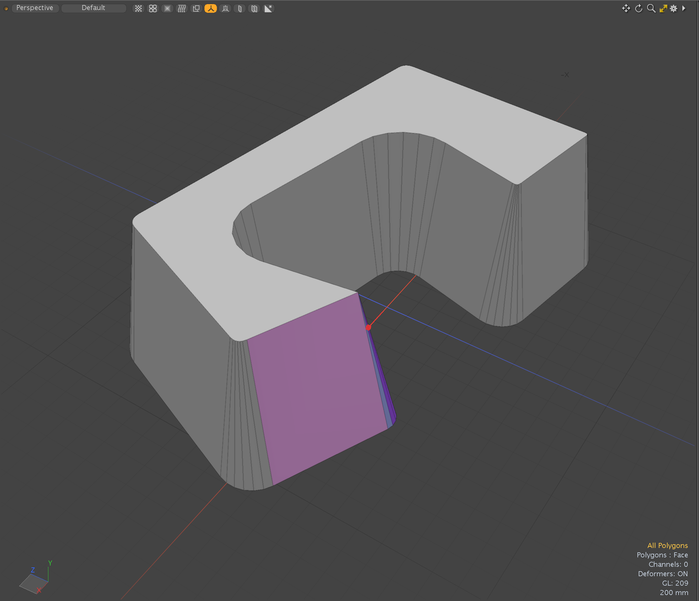

# Straight-Skeleton for Modo plug-in
This is an experimental Modo Plug-in kit to use Straight-Skeleton algorithm for Modo modeling workflow. [Straight skeleton](https://en.wikipedia.org/wiki/Straight_skeleton) is a method of representing a polygon by a topological skeleton. 

This kit contains a tool plugin and a procedural mesh operator.

This kit is implemented using [CGAL](https://cgal.org) libraray.

## Installing
- Download lpk from releases. Drag and drop into your Modo viewport. If you're upgrading, delete previous version.

## How to use the plugins
- The tool version of Skeleton can be launched from "Skeleton" button on Polygon tab of Modo ToolBar on left.
- The procedural mesh operator version is available on Mesh Operator viewport. That is categorized in Polygon tab.
<div align="left">

</div>

## Skeleton mode
Skeleton mode creates straight skeleton in the interior of 2D polygon with holes.
<div align="left">


</div>

## Extrude mode
Extrude mode constructs the straight skeleton-based extrusion of a polygon with holes.  <bt>
- **Maximum Height**: The maximum height of the extrusion <bt>
- **Scale**: Scale height of extruded vertex positions <bt>
<div align="left">




</div>

## Duplicate mode
Duplicate mode creates the inner or outer loops with holes at distance offset of the 2D polygon. And it creates face polygons with the offset loops. <bt>
- **Offset**: Offset amount <bt>
- **Shift**: Shift amount <bt>
- **Steps**: Steps to interpolate shift <bt>
<div align="left">


</div>

## Offset mode
Offset mode creates the inner or outer loops with holes at distance offset of the 2D polygon. And it moves source vertex positions to the closest positions of the offset loop. <bt>
- **Offset**: Offset amount <bt>
- **Merge**: Merge co-located offset vertices <bt>
<div align="left">


</div>

## Dependencies

- LXSDK  
This kit requires Modo SDK (Modo 16.1v8 or later). Download and build LXSDK and set you LXSDK path to LXSDK_PATH in CMakeLists.txt in triagulate.
- CGAL library 6.0.1 (https://github.com/cgal/cgal)  
This also requires CGAL library. Download and CGAL from below and set the include and library path to CMakeLists.txt in triagulate.
- Boost 1.87.0 (https://www.boost.org/)
- GMP 6.3.0 (https://gmplib.org/)
- MPFR 4.2.1 (https://https://www.mpfr.org/)


## License

```
This software is based part on CGAL (The Computational Geometry Algorithms Library):
Licensed under the GPL-3.0 license.
https://cgal.org
```
